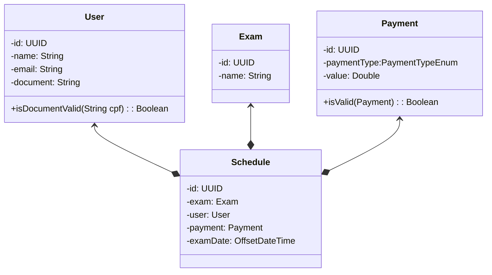

# Bexam

Sistema de busca e agendamento de exames

## Autores

- [Leandro Pinheiro](https://github.com/leaandropinheiro)
- [Gabriel Guidini](https://github.com/gabrielguidini)

## Stack utilizada

**Front-end:** Vue, Vuex e Vuetify

**Back-end:** Java e Spring

**Database:** PostgreSQL

## Funcionalidades

- Tela de login
- Tela para busca de exames
- Tela para listagem e comparação dos exames

## Diagrama

